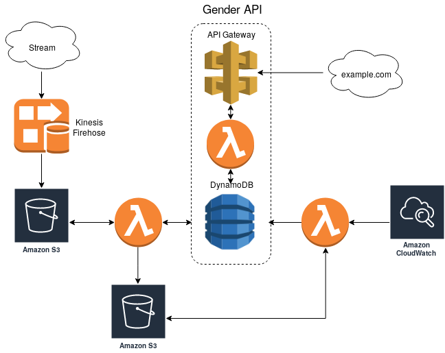

# Case Study - Gender Service

This repo contains the code to deploy a serverless data pipeline using AWS Kinesis, S3, Dynamodb, Lambda and API Gateway services.

The architecture is coded as a CloudFormation template for easier deployment to the aws cloud.

## Pipeline overview

The pipeline was designed using "serverless" services from AWS to store and process streams of data from visitor's page hits. This pipeline also provides a gender API service to fetch the gender of visitors via an identifier passed as a `GET` request.

The architecture design of the pipeline in this repo can be seen in the image below. This type of architecture requires little maitenance while being capable of handling large loads of data by elasticaly scaling from dozens to thousands of requests per second without special oversight.

<p align="center"></p>

## Requirements

To deploy this architecture, it is required the following tools in order to set it up with the provided commands in this repo:

- Linux
- Python 3.6+ (pip)
- [docker](https://www.docker.com/)
- [AWS CLI](https://github.com/aws/aws-cli)
- [AWS SAM](https://github.com/awslabs/serverless-application-model)
- AWS account

> Note: Ensure that the linux distribution you are using comes with Python 3.6+ (ubuntu 16.04+ is a good choice).

### Python dependencies

The Python's lib dependencies are available via a `Pifile` and `requirements.txt` in this repo.

If you are using `pipenv` you can install the dependencies using:

```bash
pipenv install
```

If you are using `virtualenv`, `conda` or the default python env, to install the requirements you need to do the following:

```bash
pip install -r requirements.txt
```

### Installing docker

To install docker, follow this guide in the official docker documentation: https://docs.docker.com/install/linux/docker-ce/ubuntu/

### Installing AWS CLI

Installing the aws cli is pretty straight forward. To do so, run the following command in a terminal:

```bash
pip install awscli
```

### Installing AWS SAM

Installing AWS Serverless Application Model (SAM) is simple and requires you to have docker, aws cli and pip installed in your machine. To install AWS SAM, you can follow the official install guide from AWS: https://docs.aws.amazon.com/serverless-application-model/latest/developerguide/serverless-sam-cli-install.html

### Getting an AWS account

If you do not have an aws account with programmatic access, you first need to create one before proceeding any further. To do so, follow the official guide here and create an account: https://aws.amazon.com/premiumsupport/knowledge-center/create-and-activate-aws-account/

When getting access to AWS services, create an account for programmatic access (and console access as well) in order to be able to deploy the pipeline in the aws cloud. This short [youtube video](https://www.youtube.com/watch?v=TbzbrkaB_Uo) should help you create one in case you don't know yet how to do it.

## Getting started

Before proceeding to deploy the architecture, you will need to define two environment vars containing your aws's access key and secrets. To set them up, do the following commands in a terminal window:

```bash
export AWS_ACCESS_KEY=<your_access_key>
export AWS_SECRET_KEY=<your_secret_key>
```

After this is done, in order to deploy and test the architecture, you need to build, package and deploy the architecture template to aws cloud. Afterwards, to really test the architecture, some dummy data needs to be generated in order to see the pipeline working as expected.

To simplify these processes, several macros are available in the `Makefile` in the root of this repo.

The next sections follows the 4 steps needed to start using and testing the pipeline:

1. Building the source code
2. Packaging the code and generate a cloudformation template
3. Deploy the cloudformation template to aws cloud
4. Generate dummy data to test the pipeline

### Building the source code

The first step to deploy the pipeline starts with building the lambda code stored in the following folders:

- `kinesis_firehose_stream_process/`: contains the code used to preprocess the data stream generated by Kinesis Firehose
- `process_stream_data/`: contains the code used to compress the stream data to [parquet](https://parquet.apache.org/) format, process the visitor's gender hits and update the dynamodb table state
- `daily_process_lambda/`: computes the daily page hits of all visitors on the previous day, computes the top gender of the last 7 days of visitors and updates the dynamodb table state
- `gender_api_lambda/`: retrieves the gender data of a visitor via a `clientid` from the dynamodb table

To to this, run the following command in the terminal:

```bash
make build
```

This will build the lambda code and their lib requirements from these folders automatically to be deployed to AWS S3 so AWS Lambda can access these functions.

### Packaging the code

Next, the code and its dependencies need to be bundled and stored in a S3 bucket in order for AWS Lambda to access it, and to transform the `template.yaml` to a valid cloudformation template.

To package and generate the cloudformation template, run the following command in the terminal:

```bash
make package
```

### Deploying the code

Finally, the architecture can be deployed to the aws cloud by using the cloudformation template generated in the previous step:

```bash
make deploy
```

This will take a few minutes for AWS to to spin up the services. You can check its progress by visiting the CloudFormation service in the AWS console. When the services and ready to run, the command shall stop and you should be able to run additional commands in the terminal.

### All-in-one command

You can accomplish the 3 previous commands with the following macro to build, package and deploy the pipeline with a single command:

```bash
make setup-all
```

### Generating dummy data

To see the pipeline working in its full potential, it would be best to generate data of some previous days in order to see the effects of computing the top gender in the last 7 days. To do so, run the following command in the terminal which generate some dummy data for the last 10 days (from the current time ofc):

```bash
make generate-dummy-data
```

### Generating streams of data

To generate streams of dummy data you can run the following command

```bash
make generate-stream-data
```

You can define the number of requests per second by using the `requests_per_second` input arg:

```bash
make generate-stream-data requests_per_second=50
```

### Cleaning up

After you tested and experimented with the pipeline, you can stop and delete the cloudformation stack with the following command:

```bash
make delete-stack
```

> Note: S3 buckets containing files won't be deleted by default, so you need to manually delete them to clean your environment in case the buckets used contain objects.

### Unit tests

You can run the unit tests of the lambda functions used to process the stream data by running the following command in the terminal:

```bash
make test
```

This will run all unit tests inside the `tests/` folder.

> Note: `pytest` module is required to run the tests.

# License

[MIT](LICENSE)